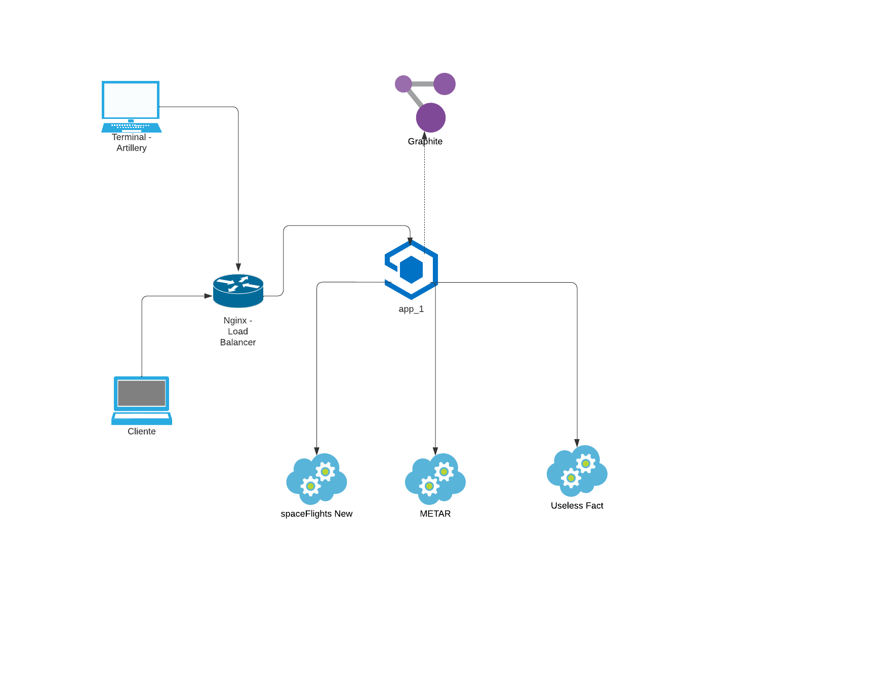
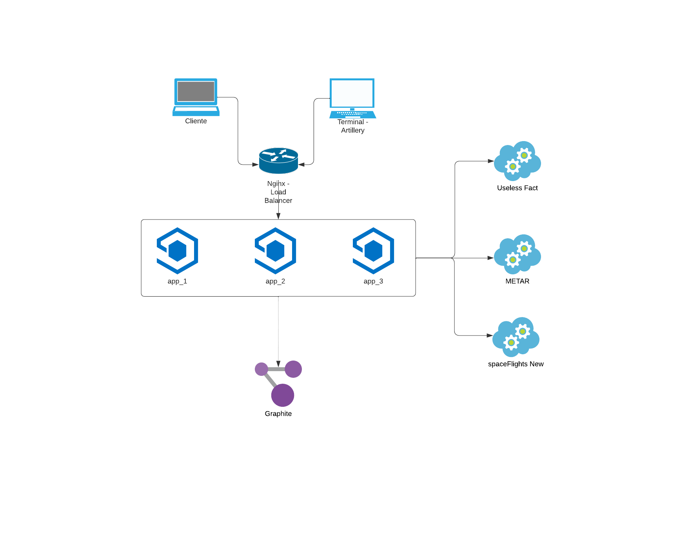
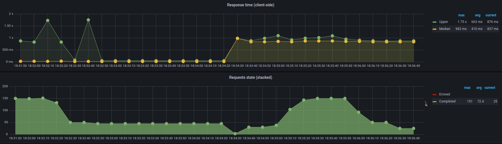
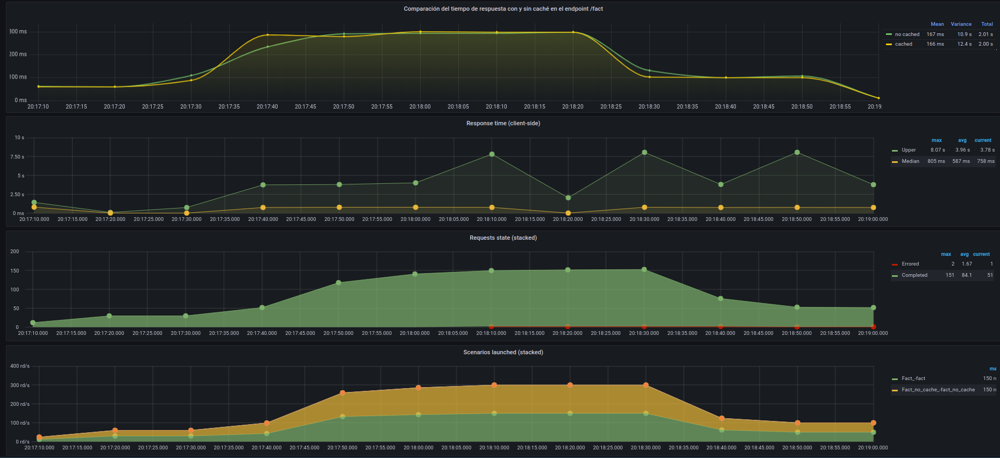

# Trabajo practico 1

## Objetivo

Implementar un servicio HTTP en Node.js-Express que represente una API que consume otras APIs para dar información a sus usuarios, similar a lo que brindaría una API para una página de inicio personalizada. Someter sus endpoints a diversas intensidades/escenarios de carga en algunas configuraciones de deployment, tomar mediciones y analizar resultados.

## Ejecución del proyecto

Para poder levantar los servicios en docker, hay que ubicarse en la raíz del proyecto y ejecutar:

`sudo docker-compose up --build`

Luego de que se hayan levantado los servicios, verificaremos que esten correctos de la siguiente forma:

`curl localhost:5555/api/ping`

Este endpoint nos devolvera un valor constante.

## Vista de conectores y servicios

A continuación se muestra el diagrama de Vista de Componentes y Conectores para el caso base, el cual contempla un solo nodo, y para el caso en donde se tienen Réplicas de la API.

## Caso base

Se pudo constatar que el proceso de consulta, tanto a través de Artillery como por medio de un cliente, transita por el proxy de Nginx en primer lugar, el cual se encarga de remitir la petición correspondiente al servidor de origen. Además, se dispone del servicio de Node.js, que efectúa solicitudes a las APIs externas mencionadas previamente.

## Caso 3 replicas

La principal distinción con el caso previo radica en que se observa a Nginx desempeñándose como un balanceador de carga, distribuyendo el tráfico a cada una de las instancias de nuestro servicio.

## Endpoints:

- `/ping`: Este endpoint devolverá un valor constante, sin procesamiento. Lo utilizaremos como healthcheck y como baseline para comparar con los demás.

- `/metar?station=<code>`: Es un reporte del estado meteorológico que se registra en un aeródromo. Se lo codifica en un string.

- `/space_news`: Devolveremos solo los títulos de las 5 últimas noticias sobre actividad espacial

- `/fact`: Devolveremos 1 hecho sin utilidad por cada invocación a nuestro endpoint, obtenido desde uselessfacts.

## Performace

Para poder analizar la performace de nuestro programa, se uso Artillery como generador de cargas. Dividiendo las fases en estos pasos:

- `START` en donde se envian 3 request por segundo durante un periodo de de 30
- `FIRSTRAMP` en donde aumentamos los request por segundo en un periodo de 15
- `PLAIN` en donde mantenemos el ritmo de request que se llego en la fase anterior por unos 40 segundos
- `RAMPDOWN` en donde empezamos a bajar la cantidad hasta que los request sean 3/s
- `REST` en donde frenamos las solicitudes por 15 segundos mas.

## LoadBalancer y Rate limit

Decidimos limitar el rate mediante `Nginx` ya que la limitación de la tasa se aplica a nivel del servidor web en sí. Esto significa que la limitación se puede aplicar antes de que las solicitudes lleguen a la aplicación en el servidor, lo que reduce la carga en el servidor. Limitamos el acceso a la API a 10 solicitudes por minuto por dirección IP. En el caso que el limite de la tasa de solicitud que establecimos, que son 10 megas, se ha alcanzado, Nginx devolvera un error 429 (Too many Requests).

Para que el nginx funcione como un load balancer, a cada server le establecimos un weight=2, para que cada servidor reciba 2 requests y tengan la misma proporción entre todas.

## Cache

Toda información obtenida mediante las apis, fueron cacheados con redis. A la hora de cachear los elementos, no se estipulo un limite de items en caché. Sin embargo, para cada item cacheado, se le seteo un tiempo de expiración, que puede ser 5 o 15 segundos. El llenado del cache fue hecho mediante un Lazy population.

## Metricas

Gráficos adicionales obtenidos adicionalmente al dashboard original:

- Demora de cada endpoint en responder
- Demora de cada API remota en responder

# Resultados obtenidos.

### Ping

Como especificamos anteriormente, es un simple healthcheck por lo que se espera un tiempo de respuesta bajo como asi tambien su uso recursos.

## News Space

### Api vs Endpoint

En este primer grafico se puede observar la notoria diferencia de tiempo entre que se llama a la api a comparacion de cuando se llama al endpoint. Como primer punto a destacar es que nos afirma que por mas que parezca o suenen similares, en realidad tienen un significado muy distinto.

Cuando el llamado al endpoint es mucho mayor al de la api, como en este caso, nos puede dar algunos indicios.

- Primero es que puede tener un problema de escalabilidad, ya que el endpoint esta siendo utilizado simultaneamente por muchos usuarios y no puede optimizarse ante tantos request, aumentando su tiempo de respuesta.

- Problemas de hardware: si el servidor que maneja el endpoint tiene recursos muy limitados, puede aumentar el tiempo de respuesta. Esto se puede ver reflejado al momento de usar el api limiter, ya que en este caso, aunque se puso un valor a prueba, se deberia ver reflejado es la capacidad que tenga la maquina que tiene el endpoint.

### Metricas del server

Se puede observar que devolvio exitosamente todas las solicitudes que se le pidio, por lo que apriori nos genera confianza de que no nos va a dovolver ningun error. Ademas, indica que la API tiene un buen rendimiento, ya que esta disponible en todo momento y puede manejar gran cantidad de solicitudes sin que se rompa.

Otra cosa a destacar es su bajo tiempo de respuesta, esto se debe a todas las herramientas utilizadas, sea el cache como aumentar la cantidad de nodes que van a responder a la solicitud.

## Fact

Algo importante que observamos, es que el tiempo de respuesta con o si cache son muy similares. Esto puede deberse a que el endpoint no se esta utilizando con suficiente frecuencia o quiza el endpoint ya de por si es muy rapido. En ambos casos la utilizacion de la cache no va a impactar significativamente en el tiempo de respuesta como en los casos anteriores.

Otra observación para analizar, es que de todos los request que se solicitaron, esta vez si fallaron algunos. Esto puede ocurrir por un abanico muy grande de opciones, sea el estado del servidor, la capacidad del endpoint ante un numero alto de solicitudes, o una falla en el codigo de la api. En este caso no es tan grave ya que es un porcentaje muy bajo, pero si fuese mayor requeriria un analisis mas profundo de lo que esta pasando.

Como pasa anteriormente, el tiempo de respuesta del endpoint es bastante mayor al de la api.

## Metar

En los resultados observados al mandar solicitudes en esta api, no se observan diferencias significativas ya explicadas anteriormente se cumple el mismo patron observado anteriormente. Este sea la diferencia de tiempo entre la api y el endpoint, el tiempo de respuesta y la cantidad completada de request.

## Comparaciones generales

En los siguientes gráficos, podemos observar el comportamiento y rendimiento de la aplicación a la hora de ejecutar 3 pruebas simultaneas que consumen 3 endpoints diferentes. Podemos observar que la aplicación pudo mantener la conectividad durante las pruebas, y cada endpoint tuvo un promedio de 120 ms de respuesta por request.
La aplicación en promedio tardo 749 ms en devolverle una respuesta al cliente.

