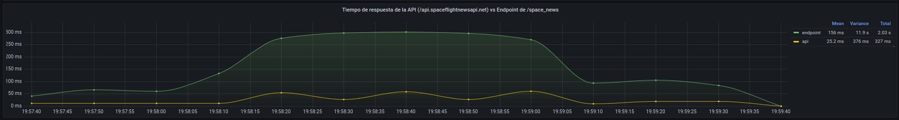
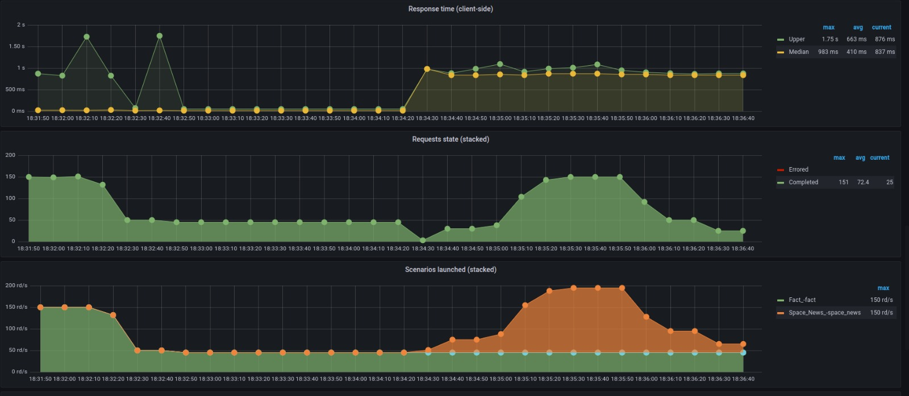
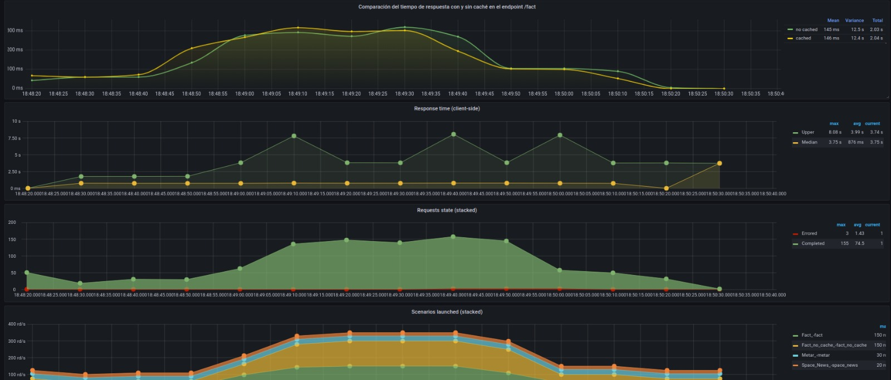
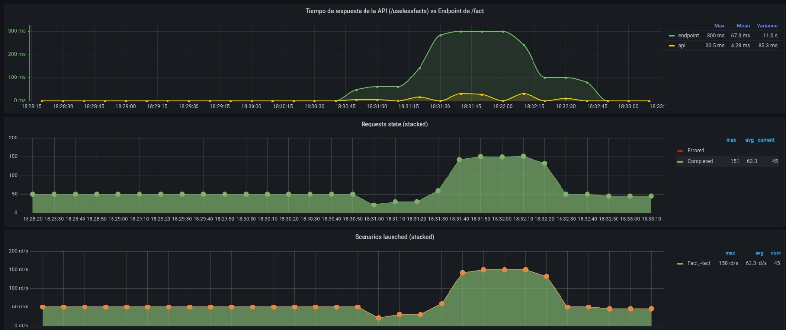
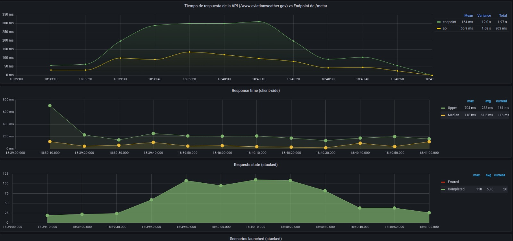
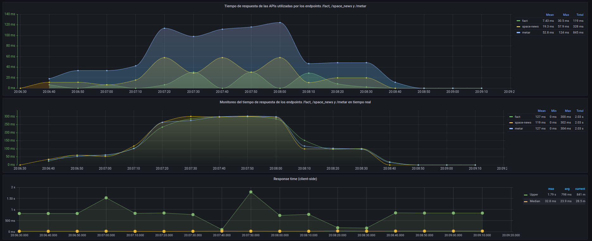

# Trabajo practico 1

## Objetivo

Implementar un servicio HTTP en Node.js-Express que represente una API que consume otras APIs para dar información a sus usuarios, similar a lo que brindaría una API para una página de inicio personalizada. Someter sus endpoints a diversas intensidades/escenarios de carga en algunas configuraciones de deployment, tomar mediciones y analizar resultados.

## Ejecución del proyecto

Para poder levantar los servicios en docker, hay que ubicarse en la raíz del proyecto y ejecutar:

`sudo docker-compose up --build`

Luego de que se hayan levantado los servicios, verificaremos que esten correctos de la siguiente forma:

`curl localhost:5555/api/ping`

Este endpoint nos devolvera un valor constante.

### Endpoints:

- `/ping`: Este endpoint devolverá un valor constante, sin procesamiento. Lo utilizaremos como healthcheck y como baseline para comparar con los demás.

- `/metar?station=<code>`: Es un reporte del estado meteorológico que se registra en un aeródromo. Se lo codifica en un string.

- `/space_news`: Devolveremos solo los títulos de las 5 últimas noticias sobre actividad espacial

- `/fact`: Devolveremos 1 hecho sin utilidad por cada invocación a nuestro endpoint, obtenido desde uselessfacts.

### Performace

Para poder analizar la performace de nuestro programa, se uso Artillery como generador de cargas. Dividiendo las fases en estos pasos:

- `START` en donde se envian 3 request por segundo durante un periodo de de 30
- `FIRSTRAMP` en donde aumentamos los request por segundo en un periodo de 15
- `PLAIN` en donde mantenemos el ritmo de request que se llego en la fase anterior por unos 40 segundos
- `RAMPDOWN` en donde empezamos a bajar la cantidad hasta que los request sean 3/s
- `REST` en donde frenamos las solicitudes por 15 segundos mas.

## LoadBalancer y Rate limit

Decidimos limitar el rate mediante `Nginx` ya que la limitación de la tasa se aplica a nivel del servidor web en sí. Esto significa que la limitación se puede aplicar antes de que las solicitudes lleguen a la aplicación en el servidor, lo que reduce la carga en el servidor. Limitamos el acceso a la API a 10 solicitudes por minuto por dirección IP. En el caso que el limite de la tasa de solicitud que establecimos, que son 10 megas, se ha alcanzado, Nginx devolvera un error 429 (Too many Requests).

Para que el nginx funcione como un load balancer, a cada server le establecimos un weight=2, para que cada servidor reciba 2 requests y tengan la misma proporción entre todas.

## Cache

Toda información obtenida mediante las apis, fueron cacheados con redis. A la hora de cachear los elementos, no se estipulo un limite de items en caché. Sin embargo, para cada item cacheado, se le seteo un tiempo de expiración, que puede ser 5 o 15 segundos. El llenado del cache fue hecho mediante un Lazy population.

## Metricas

Gráficos adicionales obtenidos adicionalmente al dashboard original:

- Demora de cada endpoint en responder
- Demora de cada API remota en responder

# Resultados obtenidos.

### Ping

Como especificamos anteriormente, es un simple healthcheck por lo que se espera un tiempo de respuesta bajo como asi tambien su uso recursos.

## News Space

### Api vs Endpoint

### Metricas del server

## Fact

## Metar

## Comparaciones generales

